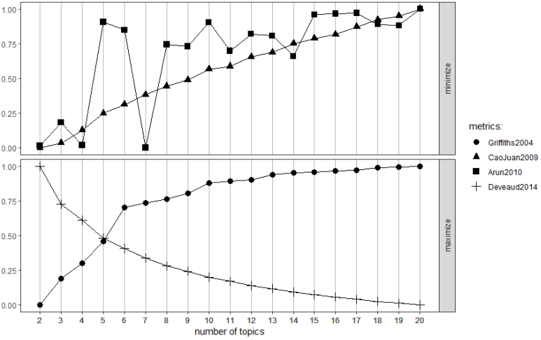
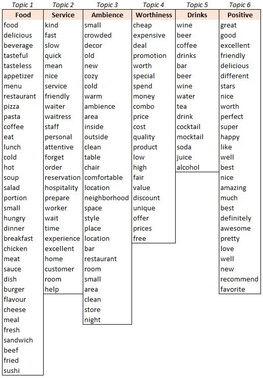
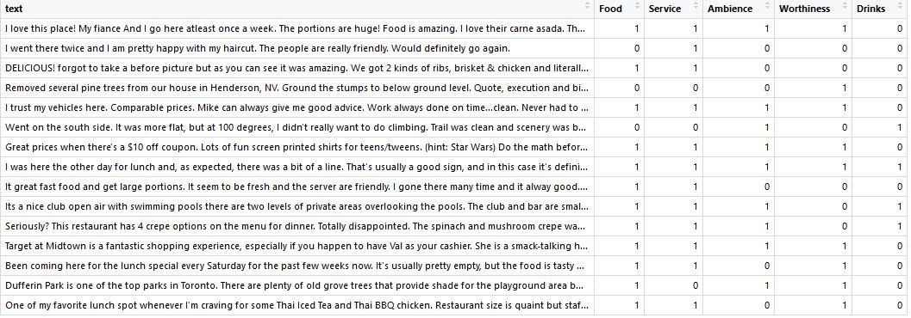
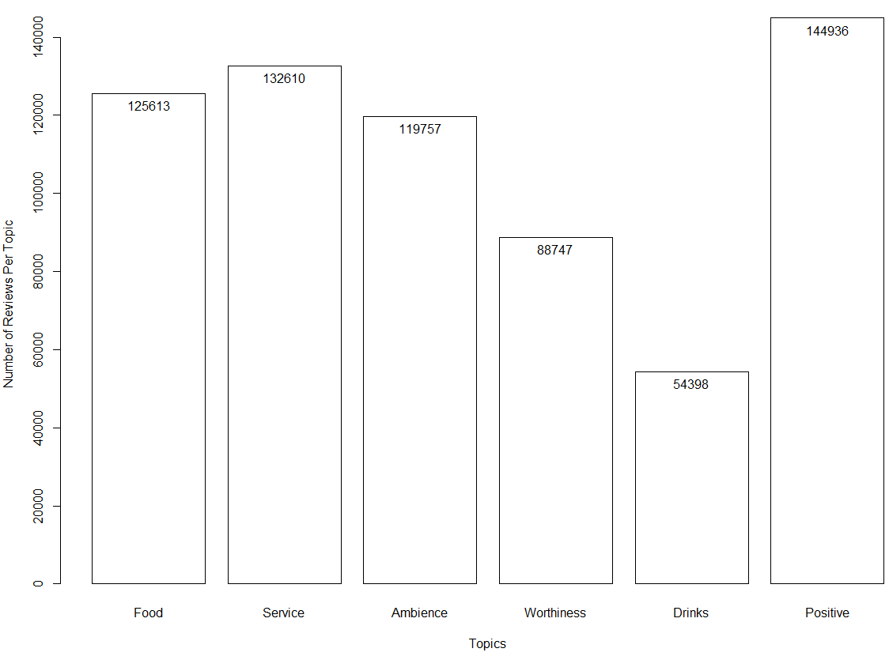
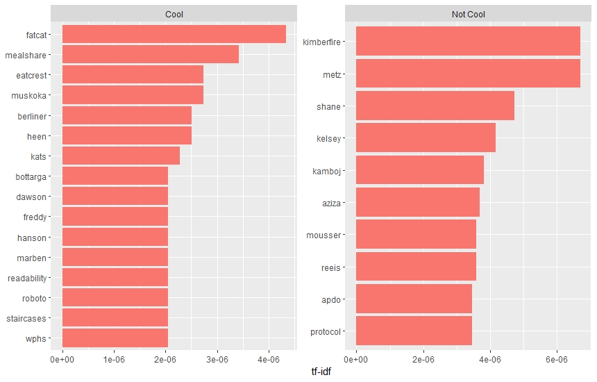
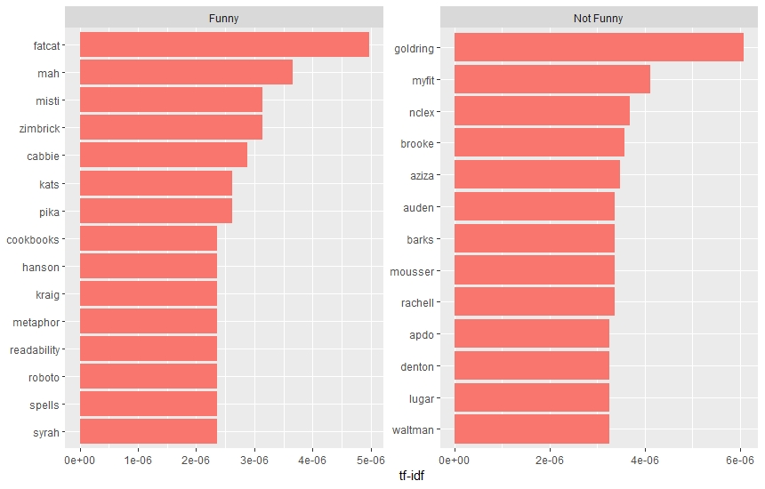
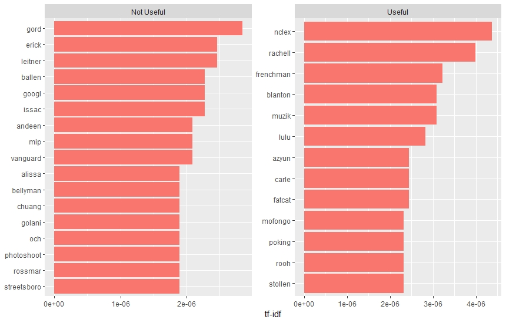
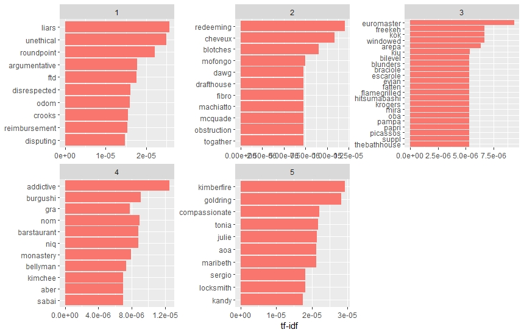

### **Introduction**
\

Topic Modelling in Machine learning and Natural Language Processing(NLP) is a type of statistical model for discovering the abstract "Topics" that occur in a collection of documents. Topic modeling is a frequently used text-mining tool for discovery of hidden semantic structures in a text body. In this Project Topic Modelling is performed on Reviews dataset from YELP(a review site with social networking features). We have built a classifier that automatically classifies restaurant business reviews into topics.


The aim of this project is to do the following :

1) Find the optimal Number of hidden Topics in the reviews.
2) Unsupervised Machine Learning(LDA) to find out what the Topics are
3) Dictionary based Approach to classify text into representing chosen topics
4) Supervised Machine Learning(TF-IDF) to get deeper understanding based on parameters of Data. 


This information, when presented to the user by classifying reviews into various relevant categories, can prove to be very effective in making an informed decision. Although, the desired approach of this work is useful for any kind of business, in this case we limit the scope of our classifier to only restaurants.


Since a review can be associated with multiple categories at the same time, it is not a binary classification or a multi-class classification. It is rather a multi-label classification problem.


### **Dataset**
\

The Yelp dataset released for the academic challenge contains information for 11,537 businesses. This dataset has 8,282 check-in sets, 43,873 users, 229,907 reviews for these businesses. For our study we have considered only the business that are categorized as food or restaurants. This reduced the number of business to around 5,000 with 157,756 reviews. 


The Data contains UserId of the User who posted the Reviews, BusinessId, Stars given by the User, Review text, and whether the review is Useful, Funny or Cool.


### **Pre Processing**
\

This will be performed before all 4 upcoming approaches in order for the data to be adequate and the methods can be applied correctly.


We applied text mining tecniques to bring structure to our reviews with the help of the r packages *tidyverse*, *tidytext*, *topicmodels*, *tm*, *SnowballC*.


For extracting textual features, Below Steps were Used :


1) Save Data in a Corpus. 
2) Remove Punctuation from Text
3) Remove Numbers
4) Strip Whitespaces
5) Converting it to lower-case 
6) Removing stop words. 
7) The cleaned text is then tokenized to collect unigrams (individual words).
8) High Frequency Words which are general to all topics such as "one","day" etc has also been removed.


\
It is important to  note that in the last step of text pre-processing (high frequency word removal), the list of chosen words to be removed differs depending on the method (the list of words removed for the TF-IDF method is different from the list of words removed for the LDA method).


### **Determination of number of topics**
\

In order to determine the optimal number of topics to use, there are multiple methods available but for this case study we evaluated our data with the function *FindTopicsNumber* from the *ldatunning* package. In this package we could graph 4 different metrics. 


From the plot we found that *CaoJuan2009* , *Arun2010*, *Deveaud 2014* were not quite useful to us as we did not see a clear elbow.


The metric that best helped us determine the number of topics was *Griffths2004*. This helped us determine that the number of topics to use was 6 as this is the place where the elbow of the tred for *Griffths2004* started as we can see in the graph below. 


The *Griffths2004* metric was developed by Thomas L. Griffiths and Mark Steyvers. Their method evaluates the consequences of changing the number of topics in NLP. They use the Gibbs sampling algorithm and their results have several interesting applications that can make it easier for people to understand the information contained in large knowledge domains, including exploring topic dynamics and indicating the role that words play in the semantic content of documents.


\

\


### **Unsupervised Machine Learning Approach using LDA method**
\

Firstly Preprocessing on the data was performed with steps as explained above. Then LDA was performed.


Latent Dirichlet Allocation (LDA) is a generative topic bag of words model that automatically discovers topics in text documents. This model regards each document (observations of words) as a mixture of various topics, and that each word in the document belongs to one of the document's topics. 


In LDA, each document can be viewed as a mixture of several categories. This is similar to Probabilistic Latent Semantic Analysis (pLSA), except that in LDA it is assumed that the distribution of categories has an a priori distribution of Dirichlet . In practice, this results in mixtures of categories in a more reasonable document. 


The key in LDA is that words follow a bag of words hypothesis or, rather than order does not matter, that the use of a word is to be part of a topic and that it communicates the same information no matter where it is in the document. This hypothesis says that "Jaison liked Pizza" is the same as "Nitesh liked Sushi". In both cases, the set of words is the same together with the frequency of each word. This assumption is necessary so that the probabilities are interchangeable and allow a greater application of mathematical methods. Although it occasionally deals with semantically different phrases like the same thing, it works well in a general document.


The LDA model sees this as a whole and chooses the themes from there. If the documents were compared individually, it could be the case that certain topics were not picked up, and only when the whole body is seen do certain topics begin to be noticed. In this example, words such as networks can appear several times in documents relative to any department. Essentially, LDA creates a more realistic model of the body, and therefore, of individual documents. The words that appear less frequently in unique documents, but are common in many different documents, are probably indicative of a common theme among the documents. When a summary is generated 


k = 6 was chosen as a result of algorithm to find the optimal number as already explained above.


We were able to visualize 6 topics and their frequency of words.


Results : 

\


As we can see that the text are speaking about different Categories but still there are some words which are common among the different topics. So we used this words from LDA to prepare the dictionary which we used for the Dictionary approach mentioned below to be more precise.


### **Extension of LDA to a Dictionary-based Approach**
\

This is the extension of LDA and 6 different Dictionaries were created with words appearing in LDA pertaining to the Topics 

1) Food 
2) Service
3) Ambience
4) Worthiness
5) Drinks
6) Positive


The words from review text were matched with words from individual dictionaries to give a clear explanation about which of all 6 topics each individual review was talking about.


The following image shows the final list of words used per topic:    


\



\
Once the list of words was finalized, the matching between the dictionary and the text reviews was made. The outcome was a table indicating whether each text contained words included in each topic. The image below can illustrate this procedure:   


\



\
Finally, the topic distribution results as seen in the following chart:  


\
```{r, out.width = "400px", echo=FALSE}

```


### **Supervised approach using TF-IDF method**
\

The Term frequency- Inverse Document Frequency (TF-IDF) method is a statistic that measures how important a term is relative to a document.


The general idea behind how TF-IDF works is this:


1) Words that are very common in a specific document are probably important to the topic of that document
2) Words that are very common in all documents probably aren't important to the topics of any of them


Here, based on the details about the reviews (Cool, Funny and Useful) the Words are distributed as shown below:


\
```{r, out.width = "400px", echo=FALSE}

```
\


```{r, out.width = "400px", echo=FALSE}

```
\


```{r, out.width = "400px", echo=FALSE}

```
\


Together with the text reviews users also rate businesses with stars. 1 star being the lowest and 5 stars the highest score. After testing the TF-IDF method on the stars score, some useful insights are discovered:


* Users who rate a business with 1 star usually express a very negative experience.
\

* We can see that in Stars 1,2 the reviews are containing quite negative words where as where as with better stars better words which describes that the tf-idf is performing as expected.


The chart below shows the word distribution based on star rating:  


\



\


As can be seen in the previous charts, the TF-IDF method is useful for specific cases and gives an overall opinion of Reviews per Category.


### **Conclusion **
\

From this Case Study we can conclude that Internet Reviews are straightforward.


When compared the results of LDA and TF-IDF, LDA is able to bring up the words close to topics which help us in understanding the Topics better. In TF-IDF on this dataset is more about details is due to the fact that TF-IDF algorithm cannot perform well in user reviews in general. For example "Margarita was tasty. Food was decent, but seriously, who doesn't double stack their corn tortillas for tacos?!? A single corn tortilla has zero structural integrity, so I'm left forking my taco (Lame pun intended)." In this LDA is able to tell us a general topic we can judge is food but TF-IDF is not able to.


Based on the data the Topics may vary and the method/algorithm can vary as well.  


We finally concluded that it makes sense to categorize the Review text that we have in hand into the 6 different topics mentioned above. It is also possible to use less or more topics but the outcome would change.  


### **Future Implications**
\

When it comes to text mining, there are still a lot of areas of improvement due to the fact that machines do not have the same logic as the human brain. In this project we found some future recommendations that would definitely bring more value to the resutls.


1) Spelling checks and idioms to be expanded to internet reviews as the words are not following the dictionary standards.
2) Stemming of words
3) Topic Modelling with Perplexity
4) Cosine Similarity on LDA


### **References**
\


1) https://www.rdocumentation.org/packages/ldatuning/versions/0.2.0/topics/FindTopicsNumber

2) https://quantdev.ssri.psu.edu/sites/qdev/files/topic_modeling_tutorial-Gutenberg-chapter_as_document_0.html

3) https://cran.r-project.org/web/packages/ldatuning/vignettes/topics.html

4) https://www.pnas.org/content/101/suppl_1/5228

5) https://www.kaggle.com/rtatman/nlp-in-r-topic-modelling

6) https://www.r-bloggers.com/topic-modeling-in-r-2/

7) https://cran.r-project.org/web/packages/topicmodels/vignettes/topicmodels.pdf

8) https://es.wikipedia.org/wiki/LDA


